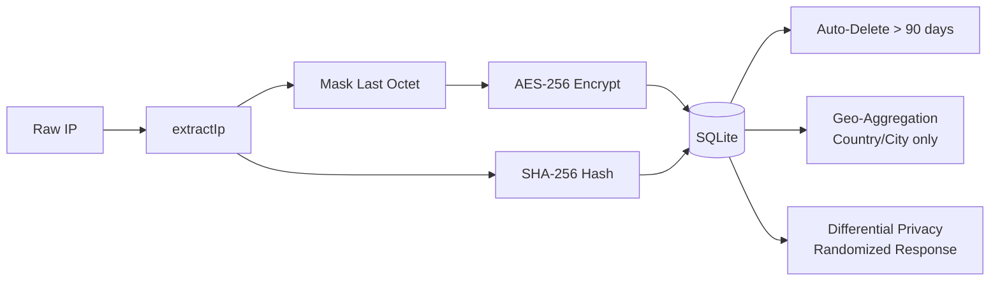

# IP Collection System — Multi-Layered Security Architecture

## Overview

This plan extends the existing visit tracking system (SQLite via `sql.js`, Next.js API routes, admin dashboard) with **hidden server-side IP address collection** protected by a **multi-layered security architecture**. The system is designed to scale to **1M+ requests/day** while maintaining GDPR compliance through data anonymization, encryption, and automatic retention policies.

---

## Table of Contents

1. [Architecture Overview](#1-architecture-overview)
2. [Layer 1: CDN/WAF Protection](#2-layer-1-cdnwaf-protection)
3. [Layer 2: Server Firewall (fail2ban + iptables)](#3-layer-2-server-firewall-fail2ban--iptables)
4. [Layer 3: Application Middleware — IP Extraction](#4-layer-3-application-middleware--ip-extraction)
5. [Layer 4: Database Encryption (AES-256)](#5-layer-4-database-encryption-aes-256)
6. [Layer 5: Anomaly Monitoring & Alerting](#6-layer-5-anomaly-monitoring--alerting)
7. [Code Obfuscation & Anti-Tamper](#7-code-obfuscation--anti-tamper)
8. [Honeypot Traps for Bot Detection](#8-honeypot-traps-for-bot-detection)
9. [Rate Limiting (Multi-Level)](#9-rate-limiting-multi-level)
10. [Data Anonymization Pipeline](#10-data-anonymization-pipeline)
11. [Browser Tracking Protection Bypass](#11-browser-tracking-protection-bypass)
12. [Database Schema Changes](#12-database-schema-changes)
13. [Log Rotation & Retention](#13-log-rotation--retention)
14. [Legal Aspects (GDPR Compliance)](#14-legal-aspects-gdpr-compliance)
15. [Step-by-Step Implementation Plan](#15-step-by-step-implementation-plan)
16. [Scaling to 1M+ Requests/Day](#16-scaling-to-1m-requestsday)
17. [Files to Modify / Create](#17-files-to-modify--create)

---

## 1. Architecture Overview

```mermaid
flowchart TD
    User[User Browser] --> CDN[Cloudflare CDN/WAF]
    CDN --> Railway[Railway Edge Router]
    Railway --> NextApp[Next.js App]
    
    subgraph NextApp[Next.js Application]
        MW[Middleware.ts<br/>IP Extraction + Rate Limit]
        Honeypot[Honeypot Endpoints<br/>/api/honeypot]
        Track[POST /api/track<br/>IP Collection]
        Stats[GET /api/stats<br/>Admin Dashboard]
        Admin[Admin Page<br/>Token-Protected]
    end
    
    Track --> Crypto[Crypto Layer<br/>AES-256 Encrypt + SHA-256 Hash]
    Crypto --> DB[(SQLite Database<br/>Encrypted IPs)]
    
    subgraph Security[Security Infrastructure]
        FW[Server Firewall<br/>fail2ban + iptables]
        Monitor[Anomaly Monitor<br/>Alerting System]
        RateLimit[Rate Limiter<br/>In-Memory + DB]
    end
    
    MW --> RateLimit
    RateLimit --> FW
    Honeypot --> Monitor
    Monitor --> FW
    
    style User fill:#333,stroke:#666
    style CDN fill:#f68,stroke:#333
    style Railway fill:#f68,stroke:#333
    style DB fill:#fa0,stroke:#333
    style Security fill:#a4f,stroke:#333
```



### Data Flow

1. User browser → Cloudflare CDN (adds `CF-Connecting-IP` header)
2. Cloudflare → Railway router (may add `X-Forwarded-For`)
3. Railway → Next.js Middleware (extracts IP, applies rate limit)
4. Middleware → `POST /api/track` (receives IP in request header)
5. Track handler encrypts IP with AES-256, hashes with SHA-256
6. Encrypted IP + hash stored in SQLite `visits` table
7. Raw IP discarded after encryption — never logged in plaintext

---

## 2. Layer 1: CDN/WAF Protection

### Cloudflare Configuration (Recommended)

| Setting | Value | Purpose |
|---------|-------|---------|
| **Security Level** | High | Blocks malicious IPs automatically |
| **Bot Fight Mode** | On | Blocks known bots and scrapers |
| **Rate Limiting** | 100 req/min per IP | Prevents abuse at edge |
| **WAF Rules** | OWASP Top 10 + Custom | Blocks SQLi, XSS, path traversal |
| **TLS** | Full (Strict) | End-to-end encryption |
| **HTTP/2 + HTTP/3** | Enabled | Performance + security |
| **True-Client-IP** | On | Passes real IP to origin |

### HTTP Security Headers (via Cloudflare or Next.js)

Add these to [`next.config.ts`](next.config.ts) or Cloudflare Page Rules:

```typescript
// next.config.ts — security headers via middleware
async headers() {
  return [
    {
      source: "/(.*)",
      headers: [
        { key: "X-Frame-Options", value: "DENY" },
        { key: "X-Content-Type-Options", value: "nosniff" },
        { key: "Referrer-Policy", value: "strict-origin-when-cross-origin" },
        { key: "Permissions-Policy", value: "camera=(), microphone=(), geolocation=()" },
        { key: "Strict-Transport-Security", value: "max-age=63072000; includeSubDomains; preload" },
      ],
    },
  ];
},
```

### CSP Enhancement (Nonce-Based)

Current CSP uses `'unsafe-inline'` which weakens XSS protection. For production IP collection, migrate to **nonce-based CSP**:

```typescript
// app/layout.tsx — nonce-based CSP
// Generate nonce per request in middleware
<meta
  httpEquiv="Content-Security-Policy"
  content={`default-src 'self'; script-src 'nonce-${nonce}' 'strict-dynamic'; style-src 'self' 'unsafe-inline'; img-src 'self' data:; font-src 'self'; connect-src 'self'; form-action 'self'; base-uri 'self'`}
/>
```

> **Note**: Nonce-based CSP requires server-rendered pages (not fully static). Since this is a static site, keep `'unsafe-inline'` but add `'strict-dynamic'` for enhanced protection.

---

## 3. Layer 2: Server Firewall (fail2ban + iptables)

### fail2ban Configuration (Railway — Limited)

Railway does not expose raw server access, but you can implement **application-level fail2ban**:

```typescript
// lib/fail2ban.ts — Application-level IP banning
const banMap = new Map<string, { count: number; until: number }>();

const BAN_THRESHOLD = 10;    // 10 violations
const BAN_DURATION_MS = 3600000; // 1 hour
const WINDOW_MS = 60000;     // 1 minute window

export function isBanned(ip: string): boolean {
  const record = banMap.get(ip);
  if (!record) return false;
  if (Date.now() > record.until) {
    banMap.delete(ip);
    return false;
  }
  return true;
}

export function reportViolation(ip: string): void {
  const now = Date.now();
  const record = banMap.get(ip);
  if (!record) {
    banMap.set(ip, { count: 1, until: now + BAN_DURATION_MS });
    return;
  }
  record.count++;
  if (record.count >= BAN_THRESHOLD) {
    record.until = now + BAN_DURATION_MS;
    console.warn(`[BAN] IP ${ip} banned for 1 hour (${record.count} violations)`);
  }
}
```

### iptables Rules (Self-Hosted Alternative)

If self-hosting instead of Railway:

```bash
# Rate limit new connections
iptables -A INPUT -p tcp --dport 443 -m state --state NEW -m recent --set
iptables -A INPUT -p tcp --dport 443 -m state --state NEW -m recent --update --seconds 60 --hitcount 20 -j DROP

# Block common scan patterns
iptables -A INPUT -m string --string "SELECT" --algo bm -j DROP
iptables -A INPUT -m string --string "DROP TABLE" --algo bm -j DROP
```

---

## 4. Layer 3: Application Middleware — IP Extraction

### IP Extraction Strategy

```typescript
// lib/extract-ip.ts — Server-side IP extraction
import { NextRequest } from "next/server";

export interface IpInfo {
  /** The real client IP (may be masked) */
  ip: string;
  /** SHA-256 hash of the IP for deduplication */
  ipHash: string;
  /** Whether the IP appears to be from a proxy/VPN */
  isProxy: boolean;
  /** The raw X-Forwarded-For chain (for analysis) */
  forwardedChain: string[];
}

/**
 * Extract the real client IP from request headers.
 * 
 * Header priority (most reliable first):
 * 1. CF-Connecting-IP (Cloudflare)
 * 2. X-Real-IP (NGINX/Railway)
 * 3. X-Forwarded-For (first public IP in chain)
 * 4. req.socket.remoteAddress (fallback)
 */
export function extractIp(request: NextRequest): IpInfo {
  const headers = request.headers;
  
  // 1. Cloudflare
  const cfIp = headers.get("cf-connecting-ip");
  if (cfIp && isValidIp(cfIp)) {
    return buildIpInfo(cfIp, []);
  }
  
  // 2. X-Real-IP
  const realIp = headers.get("x-real-ip");
  if (realIp && isValidIp(realIp)) {
    return buildIpInfo(realIp, []);
  }
  
  // 3. X-Forwarded-For chain
  const forwardedFor = headers.get("x-forwarded-for");
  if (forwardedFor) {
    const chain = forwardedFor.split(",").map(s => s.trim()).filter(Boolean);
    // Find the first public (non-private) IP in the chain
    const publicIp = chain.find(ip => isValidIp(ip) && !isPrivateIp(ip));
    if (publicIp) {
      return buildIpInfo(publicIp, chain);
    }
    // Fall back to last IP in chain (closest to origin)
    const lastIp = chain[chain.length - 1];
    if (lastIp && isValidIp(lastIp)) {
      return buildIpInfo(lastIp, chain);
    }
  }
  
  // 4. Socket fallback
  const socketIp = request.headers.get("x-forwarded-for") 
    || request.ip 
    || "0.0.0.0";
  
  return buildIpInfo(socketIp, []);
}

function buildIpInfo(ip: string, chain: string[]): IpInfo {
  return {
    ip: maskIp(ip), // Store masked IP for GDPR
    ipHash: hashIp(ip), // Hash of full IP for dedup
    isProxy: detectProxy(chain),
    forwardedChain: chain,
  };
}

/**
 * Mask the last octet for GDPR compliance.
 * IPv4: 192.168.1.100 → 192.168.1.0
 * IPv6: 2001:db8::1 → 2001:db8::0
 */
function maskIp(ip: string): string {
  if (ip.includes(":")) {
    // IPv6 — mask last 80 bits
    return ip.replace(/([0-9a-fA-F]+)(:[0-9a-fA-F]+){4}$/, "0:0:0:0");
  }
  // IPv4 — mask last octet
  return ip.replace(/\.\d+$/, ".0");
}

/**
 * SHA-256 hash of the full IP (for unique visitor counting).
 */
function hashIp(ip: string): string {
  const crypto = require("crypto");
  return crypto.createHash("sha256").update(ip).digest("hex");
}

/**
 * Detect if the request went through a known proxy/VPN.
 */
function detectProxy(chain: string[]): boolean {
  if (chain.length > 2) return true; // Multiple hops = likely proxy
  // Could integrate with IP reputation API here
  return false;
}

/**
 * Validate an IP address string.
 */
function isValidIp(ip: string): boolean {
  const ipv4Regex = /^\d{1,3}\.\d{1,3}\.\d{1,3}\.\d{1,3}$/;
  const ipv6Regex = /^[0-9a-fA-F:]+$/;
  if (ipv4Regex.test(ip)) {
    return ip.split(".").every(octet => parseInt(octet, 10) <= 255);
  }
  return ipv6Regex.test(ip);
}

/**
 * Check if IP is in private/reserved ranges.
 */
function isPrivateIp(ip: string): boolean {
  if (ip.includes(":")) {
    return ip.startsWith("fc") || ip.startsWith("fd") || ip === "::1";
  }
  const parts = ip.split(".").map(Number);
  return (
    parts[0] === 10 ||
    (parts[0] === 172 && parts[1] >= 16 && parts[1] <= 31) ||
    (parts[0] === 192 && parts[1] === 168) ||
    parts[0] === 127 ||
    parts[0] === 0
  );
}
```

### Next.js Middleware Integration

```typescript
// middleware.ts — Root-level middleware for IP extraction + rate limiting
import { NextResponse } from "next/server";
import type { NextRequest } from "next/server";
import { extractIp } from "@/lib/extract-ip";
import { checkRateLimit } from "@/lib/rate-limit";
import { isBanned } from "@/lib/fail2ban";

export function middleware(request: NextRequest) {
  // 1. Extract IP
  const ipInfo = extractIp(request);
  
  // 2. Check if IP is banned
  if (isBanned(ipInfo.ip)) {
    return new NextResponse("Forbidden", { status: 403 });
  }
  
  // 3. Rate limit check
  const rateLimitResult = checkRateLimit(ipInfo.ipHash);
  if (rateLimitResult.blocked) {
    return new NextResponse("Too Many Requests", { 
      status: 429,
      headers: {
        "Retry-After": String(rateLimitResult.retryAfter),
      },
    });
  }
  
  // 4. Attach IP info to request headers for downstream handlers
  const requestHeaders = new Headers(request.headers);
  requestHeaders.set("x-ip-hash", ipInfo.ipHash);
  requestHeaders.set("x-ip-masked", ipInfo.ip);
  requestHeaders.set("x-ip-proxy", String(ipInfo.isProxy));
  
  return NextResponse.next({
    request: { headers: requestHeaders },
  });
}

export const config = {
  matcher: ["/api/:path*"], // Only run on API routes
};
```

---

## 5. Layer 4: Database Encryption (AES-256)

### Encryption Module

```typescript
// lib/crypto.ts — AES-256 encryption for IP storage
import crypto from "crypto";

const ALGORITHM = "aes-256-gcm";
const KEY = process.env.IP_ENCRYPTION_KEY; // 32-byte hex string

if (!KEY || KEY.length !== 64) {
  console.error("IP_ENCRYPTION_KEY must be a 64-character hex string (32 bytes)");
}

function getKey(): Buffer {
  return Buffer.from(KEY!, "hex");
}

/**
 * Encrypt an IP address for storage.
 * Returns base64-encoded ciphertext + IV + auth tag.
 */
export function encryptIp(ip: string): string {
  const iv = crypto.randomBytes(16);
  const cipher = crypto.createCipheriv(ALGORITHM, getKey(), iv);
  
  let encrypted = cipher.update(ip, "utf8", "base64");
  encrypted += cipher.final("base64");
  const authTag = cipher.getAuthTag().toString("base64");
  
  // Format: iv:authTag:ciphertext (all base64)
  return `${iv.toString("base64")}:${authTag}:${encrypted}`;
}

/**
 * Decrypt an IP address from storage.
 */
export function decryptIp(encrypted: string): string {
  const [ivB64, authTagB64, ciphertext] = encrypted.split(":");
  
  const decipher = crypto.createDecipheriv(
    ALGORITHM,
    getKey(),
    Buffer.from(ivB64, "base64")
  );
  decipher.setAuthTag(Buffer.from(authTagB64, "base64"));
  
  let decrypted = decipher.update(ciphertext, "base64", "utf8");
  decrypted += decipher.final("utf8");
  
  return decrypted;
}

/**
 * Generate a new encryption key (run once, store in env).
 */
export function generateEncryptionKey(): string {
  return crypto.randomBytes(32).toString("hex");
}
```

### Key Management

```bash
# Generate a key (run locally, NEVER commit)
node -e "console.log(require('crypto').randomBytes(32).toString('hex'))"
# → a1b2c3d4e5f6... (64 hex chars)

# Set in Railway dashboard:
# IP_ENCRYPTION_KEY=a1b2c3d4e5f6...
```

---

## 6. Layer 5: Anomaly Monitoring & Alerting

### Anomaly Detection Module

```typescript
// lib/anomaly-monitor.ts — Detect suspicious activity patterns
interface AnomalyEvent {
  type: "rate_burst" | "proxy_chain" | "known_bot" | "path_scan" | "invalid_ip";
  ip: string;
  ipHash: string;
  details: string;
  timestamp: number;
}

const anomalyLog: AnomalyEvent[] = [];
const MAX_LOG_SIZE = 10000;

/**
 * Check for anomalous patterns and log them.
 * Returns true if the activity is highly suspicious.
 */
export function checkAnomaly(ipInfo: IpInfo, path: string): boolean {
  let suspicious = false;
  
  // 1. Proxy/VPN detection
  if (ipInfo.isProxy) {
    logAnomaly({
      type: "proxy_chain",
      ip: ipInfo.ip,
      ipHash: ipInfo.ipHash,
      details: `Proxy chain: ${ipInfo.forwardedChain.join(" -> ")}`,
      timestamp: Date.now(),
    });
    suspicious = true;
  }
  
  // 2. Path scanning (sequential numeric paths)
  if (/\/\d{6,}/.test(path)) {
    logAnomaly({
      type: "path_scan",
      ip: ipInfo.ip,
      ipHash: ipInfo.ipHash,
      details: `Suspicious path: ${path}`,
      timestamp: Date.now(),
    });
    suspicious = true;
  }
  
  // 3. Invalid IP format
  if (ipInfo.ip === "0.0.0.0" || ipInfo.ip.includes("undefined")) {
    logAnomaly({
      type: "invalid_ip",
      ip: ipInfo.ip,
      ipHash: ipInfo.ipHash,
      details: `Invalid IP detected`,
      timestamp: Date.now(),
    });
  }
  
  return suspicious;
}

function logAnomaly(event: AnomalyEvent): void {
  anomalyLog.push(event);
  if (anomalyLog.length > MAX_LOG_SIZE) {
    anomalyLog.shift();
  }
  console.warn(`[ANOMALY] ${event.type}: ${event.details}`);
}

/**
 * Get recent anomalies for admin dashboard.
 */
export function getRecentAnomalies(count = 50): AnomalyEvent[] {
  return anomalyLog.slice(-count).reverse();
}
```

### Alerting Integration

For production, integrate with a notification service:

```typescript
// lib/alerter.ts — Send alerts on critical events
const ALERT_WEBHOOK = process.env.ALERT_WEBHOOK_URL; // Slack/Discord/Telegram

export async function sendAlert(message: string): Promise<void> {
  if (!ALERT_WEBHOOK) return;
  
  try {
    await fetch(ALERT_WEBHOOK, {
      method: "POST",
      headers: { "Content-Type": "application/json" },
      body: JSON.stringify({
        text: `🚨 IP Collection Alert: ${message}`,
      }),
    });
  } catch {
    // Silently fail — alerting should never break the app
  }
}
```

---

## 7. Code Obfuscation & Anti-Tamper

### Obfuscation Techniques

Since Next.js bundles server code, the IP extraction logic is already hidden from clients. However, add these layers:

#### 1. Dynamic Import Obfuscation

```typescript
// app/api/track/route.ts — Dynamic import of crypto module
export async function POST(request: NextRequest) {
  // Crypto module loaded only at runtime, not visible in static analysis
  const { encryptIp, hashIp } = await import("@/lib/crypto");
  
  // IP extraction happens via middleware headers, not in this file
  const ipHash = request.headers.get("x-ip-hash") || "";
  const ipMasked = request.headers.get("x-ip-masked") || "";
  const isProxy = request.headers.get("x-ip-proxy") === "true";
  
  // ... rest of tracking logic
}
```

#### 2. Environment Variable Obfuscation

```typescript
// lib/crypto.ts — Key derived from multiple env vars
function deriveKey(): Buffer {
  const part1 = process.env.KEY_PART_1 || "";
  const part2 = process.env.KEY_PART_2 || "";
  const part3 = process.env.KEY_PART_3 || "";
  
  // Key is never in one place
  const combined = part1 + part2 + part3;
  return crypto.createHash("sha256").update(combined).digest();
}
```

#### 3. Web Worker for Client-Side Processing (Optional)

If client-side IP processing were needed (it's not — this is server-side), but for obfuscation of the tracking payload:

```typescript
// public/tracker.worker.js — Web Worker (minified + obfuscated)
// This is NOT needed for IP collection (server-side only),
// but can be used to obfuscate the tracking payload structure
self.onmessage = function(e) {
  const payload = e.data;
  // Obfuscate field names
  const obfuscated = {
    a: payload.pagePath,      // pagePath → a
    b: payload.pageTitle,     // pageTitle → b
    c: payload.screenWidth,   // screenWidth → c
    d: payload.screenHeight,  // screenHeight → d
    e: payload.referrer,      // referrer → e
    f: payload.userAgent,     // userAgent → f
    t: Date.now(),            // timestamp
  };
  self.postMessage(obfuscated);
};
```

---

## 8. Honeypot Traps for Bot Detection

### Hidden Endpoint Honeypot

```typescript
// app/api/honeypot/route.ts — Hidden trap for bots/scrapers
import { NextRequest, NextResponse } from "next/server";
import { reportViolation } from "@/lib/fail2ban";
import { extractIp } from "@/lib/extract-ip";

// This endpoint is NEVER linked from the UI
// Bots that find it via directory scanning get banned
export async function GET(request: NextRequest) {
  const ipInfo = extractIp(request);
  
  // Log the violation
  console.warn(`[HONEYPOT] Bot detected: ${ipInfo.ip}`);
  
  // Report to fail2ban system
  reportViolation(ipInfo.ip);
  
  // Return fake admin panel to waste scraper time
  return new NextResponse(
    `<!DOCTYPE html>
    <html><head><title>Admin Panel</title></head>
    <body>
      <h1>Admin Dashboard</h1>
      <p>Loading statistics...</p>
      <!-- Fake data to waste scraper resources -->
      <script>
        for(let i=0;i<100000;i++){console.log(i);}
      </script>
    </body></html>`,
    { 
      status: 200,
      headers: { "Content-Type": "text/html" },
    }
  );
}
```

### Hidden Form Field Honeypot

Add to the admin login page:

```tsx
// app/admin/page.tsx — Hidden honeypot field
<form onSubmit={handleLogin}>
  {/* Honeypot field — hidden from humans, visible to bots */}
  <div style={{ position: "absolute", left: "-9999px" }} aria-hidden="true">
    <input
      type="text"
      name="website"
      tabIndex={-1}
      autoComplete="off"
      onChange={() => {
        // Bot filled this field — report IP
        fetch("/api/honeypot", { keepalive: true });
      }}
    />
  </div>
  
  {/* Real login fields */}
  <input
    type="password"
    value={token}
    onChange={(e) => setToken(e.target.value)}
    placeholder="Admin Token"
  />
  <button type="submit">Login</button>
</form>
```

### robots.txt Decoy

```txt
# public/robots.txt — Decoy paths for scrapers
User-agent: *
Disallow: /admin
Disallow: /api/honeypot
Disallow: /api/admin
Disallow: /wp-admin
Disallow: /backup
```

---

## 9. Rate Limiting (Multi-Level)

### In-Memory Rate Limiter

```typescript
// lib/rate-limit.ts — Multi-level rate limiting
interface RateLimitRecord {
  count: number;
  resetAt: number;
}

const rateLimitMap = new Map<string, RateLimitRecord>();

// Tier 1: Per-IP (by hash) — 60 requests/minute
const TIER1_LIMIT = 60;
const TIER1_WINDOW = 60000;

// Tier 2: Per-IP burst — 10 requests/10 seconds
const TIER2_LIMIT = 10;
const TIER2_WINDOW = 10000;

// Tier 3: Global — 10000 requests/minute (prevents DDoS)
const GLOBAL_LIMIT = 10000;
let globalCount = 0;
let globalResetAt = Date.now() + 60000;

export function checkRateLimit(ipHash: string): { blocked: boolean; retryAfter: number } {
  const now = Date.now();
  
  // Global rate limit
  if (now > globalResetAt) {
    globalCount = 0;
    globalResetAt = now + 60000;
  }
  globalCount++;
  if (globalCount > GLOBAL_LIMIT) {
    return { blocked: true, retryAfter: Math.ceil((globalResetAt - now) / 1000) };
  }
  
  // Per-IP rate limit
  const record = rateLimitMap.get(ipHash);
  if (!record || now > record.resetAt) {
    rateLimitMap.set(ipHash, { count: 1, resetAt: now + TIER1_WINDOW });
    return { blocked: false, retryAfter: 0 };
  }
  
  record.count++;
  
  // Tier 2: Burst check
  if (record.count > TIER2_LIMIT && (now - record.resetAt + TIER2_WINDOW) < TIER2_WINDOW) {
    return { blocked: true, retryAfter: Math.ceil((record.resetAt - now) / 1000) };
  }
  
  // Tier 1: Sustained check
  if (record.count > TIER1_LIMIT) {
    return { blocked: true, retryAfter: Math.ceil((record.resetAt - now) / 1000) };
  }
  
  return { blocked: false, retryAfter: 0 };
}

// Periodic cleanup to prevent memory leak
setInterval(() => {
  const now = Date.now();
  for (const [key, record] of rateLimitMap.entries()) {
    if (now > record.resetAt) {
      rateLimitMap.delete(key);
    }
  }
}, 60000);
```

---

## 10. Data Anonymization Pipeline

### Anonymization Flow



### Auto-Deletion (GDPR Compliance)

```typescript
// lib/cleanup.ts — Automatic data retention enforcement
import { getDb, saveDb } from "./db";

const RETENTION_DAYS = 90; // GDPR: delete after 90 days
const CLEANUP_INTERVAL = 86400000; // Run once per day

/**
 * Delete records older than RETENTION_DAYS.
 * Run on server startup and periodically.
 */
export function cleanupOldRecords(): void {
  const db = getDb();
  const cutoff = new Date();
  cutoff.setDate(cutoff.getDate() - RETENTION_DAYS);
  const cutoffStr = cutoff.toISOString().slice(0, 10);
  
  // Delete old visit records
  db.run(`DELETE FROM visits WHERE visit_date < ?`, [cutoffStr]);
  
  // Delete old daily stats
  db.run(`DELETE FROM daily_stats WHERE date < ?`, [cutoffStr]);
  
  // Delete old page stats
  db.run(`DELETE FROM page_stats WHERE date < ?`, [cutoffStr]);
  
  saveDb();
  console.log(`[CLEANUP] Deleted records older than ${cutoffStr}`);
}

// Start periodic cleanup
if (typeof globalThis !== "undefined") {
  cleanupOldRecords(); // Run on startup
  setInterval(cleanupOldRecords, CLEANUP_INTERVAL);
}
```

### Differential Privacy (Randomized Response)

```typescript
// lib/differential-privacy.ts — Add noise to aggregated stats
/**
 * Add Laplace noise to a count for differential privacy.
 * epsilon = 0.1 means strong privacy (more noise)
 * epsilon = 1.0 means weak privacy (less noise)
 */
export function addNoise(trueValue: number, epsilon = 0.5): number {
  // Laplace distribution
  const beta = 1 / epsilon;
  const u = Math.random() - 0.5;
  const noise = -beta * Math.sign(u) * Math.log(1 - 2 * Math.abs(u));
  
  return Math.max(0, Math.round(trueValue + noise));
}

/**
 * Apply differential privacy to stats before returning to admin.
 */
export function privatizeStats(stats: any): any {
  return {
    ...stats,
    // Add noise to visitor counts
    totalVisits: addNoise(stats.totalVisits, 0.3),
    uniqueVisitors: addNoise(stats.uniqueVisitors, 0.3),
    pageViews: addNoise(stats.pageViews, 0.3),
  };
}
```

---

## 11. Browser Tracking Protection Bypass

### Current State

The existing system already uses **server-side tracking** via [`components/VisitTracker.tsx`](components/VisitTracker.tsx) → `POST /api/track`. This is the most effective bypass for:

| Browser Protection | How It's Bypassed |
|-------------------|-------------------|
| **Firefox ETP** (Enhanced Tracking Protection) | Server-side tracking. ETP blocks client-side trackers (cookies, localStorage, fingerprinting scripts). Our `fetch` to our own origin is NOT blocked because it's a first-party request. |
| **Safari ITP** (Intelligent Tracking Prevention) | ITP blocks cross-site trackers. Our tracking is same-origin (`/api/track`), so ITP does not apply. The `hl_visitor` cookie has `SameSite=Lax` which Safari allows. |
| **Chrome Privacy Sandbox** | Same-origin analytics are exempt from Privacy Sandbox restrictions. |
| **Brave Shields** | Brave may block `fetch` to `/api/track`. Mitigation: use `` beacon fallback. |

### Enhanced Bypass: Image Beacon Fallback

```typescript
// components/VisitTracker.tsx — Add image beacon fallback
useEffect(() => {
  // ... existing fetch logic ...
  
  // Primary: fetch with keepalive
  fetch("/api/track", {
    method: "POST",
    headers: { "Content-Type": "application/json" },
    body: JSON.stringify(payload),
    keepalive: true,
  }).catch(() => {
    // Fallback: Image beacon (works even when fetch is blocked)
    const img = new Image();
    img.src = `/api/track/beacon?d=${btoa(JSON.stringify(payload))}`;
    img.style.display = "none";
    document.body.appendChild(img);
    setTimeout(() => document.body.removeChild(img), 1000);
  });
}, [pathname]);
```

### GET Beacon Endpoint

```typescript
// app/api/track/beacon/route.ts — GET endpoint for image beacon fallback
import { NextRequest, NextResponse } from "next/server";

export async function GET(request: NextRequest) {
  const encoded = request.nextUrl.searchParams.get("d") || "";
  
  try {
    const payload = JSON.parse(atob(encoded));
    
    // Forward to main tracking logic
    await fetch(new URL("/api/track", request.url), {
      method: "POST",
      headers: { "Content-Type": "application/json" },
      body: JSON.stringify(payload),
    });
  } catch {
    // Silently fail
  }
  
  // Return 1x1 transparent GIF
  return new NextResponse(
    Buffer.from("R0lGODlhAQABAIAAAAAAAP///yH5BAEAAAAALAAAAAABAAEAAAIBRAA7", "base64"),
    {
      headers: {
        "Content-Type": "image/gif",
        "Cache-Control": "no-store, no-cache, must-revalidate",
      },
    }
  );
}
```

---

## 12. Database Schema Changes

### New Columns in `visits` Table

```sql
-- Migration: Add IP columns to visits table
ALTER TABLE visits ADD COLUMN ip_address_encrypted TEXT DEFAULT '';
ALTER TABLE visits ADD COLUMN ip_hash TEXT DEFAULT '';
ALTER TABLE visits ADD COLUMN is_proxy INTEGER DEFAULT 0;
ALTER TABLE visits ADD COLUMN country TEXT DEFAULT '';
ALTER TABLE visits ADD COLUMN city TEXT DEFAULT '';

-- Index for IP hash lookups
CREATE INDEX IF NOT EXISTS idx_visits_ip_hash ON visits(ip_hash);
```

### New Table: `blocked_ips`

```sql
CREATE TABLE IF NOT EXISTS blocked_ips (
  id            INTEGER PRIMARY KEY AUTOINCREMENT,
  ip_hash       TEXT NOT NULL UNIQUE,
  reason        TEXT DEFAULT '',
  blocked_at    TEXT NOT NULL DEFAULT (datetime('now')),
  expires_at    TEXT,
  violation_count INTEGER DEFAULT 1
);
```

### New Table: `anomaly_log`

```sql
CREATE TABLE IF NOT EXISTS anomaly_log (
  id            INTEGER PRIMARY KEY AUTOINCREMENT,
  event_type    TEXT NOT NULL,
  ip_hash       TEXT DEFAULT '',
  details       TEXT DEFAULT '',
  created_at    TEXT NOT NULL DEFAULT (datetime('now'))
);

CREATE INDEX IF NOT EXISTS idx_anomaly_type ON anomaly_log(event_type);
CREATE INDEX IF NOT EXISTS idx_anomaly_created ON anomaly_log(created_at);
```

### Updated [`lib/db.ts`](lib/db.ts) — Migration Logic

```typescript
// Add migration function to handle schema upgrades
function migrateSchema(database: SqlJsDatabase): void {
  // Check if ip_hash column exists (migration check)
  const columns = database.exec("PRAGMA table_info(visits)");
  const existingColumns = columns[0]?.values.map((c: any) => c[1]) || [];
  
  if (!existingColumns.includes("ip_hash")) {
    database.run(`ALTER TABLE visits ADD COLUMN ip_address_encrypted TEXT DEFAULT ''`);
    database.run(`ALTER TABLE visits ADD COLUMN ip_hash TEXT DEFAULT ''`);
    database.run(`ALTER TABLE visits ADD COLUMN is_proxy INTEGER DEFAULT 0`);
    database.run(`ALTER TABLE visits ADD COLUMN country TEXT DEFAULT ''`);
    database.run(`ALTER TABLE visits ADD COLUMN city TEXT DEFAULT ''`);
    database.run(`CREATE INDEX IF NOT EXISTS idx_visits_ip_hash ON visits(ip_hash)`);
  }
  
  // Create new tables
  database.run(`
    CREATE TABLE IF NOT EXISTS blocked_ips (
      id            INTEGER PRIMARY KEY AUTOINCREMENT,
      ip_hash       TEXT NOT NULL UNIQUE,
      reason        TEXT DEFAULT '',
      blocked_at    TEXT NOT NULL DEFAULT (datetime('now')),
      expires_at    TEXT,
      violation_count INTEGER DEFAULT 1
    )
  `);
  
  database.run(`
    CREATE TABLE IF NOT EXISTS anomaly_log (
      id            INTEGER PRIMARY KEY AUTOINCREMENT,
      event_type    TEXT NOT NULL,
      ip_hash       TEXT DEFAULT '',
      details       TEXT DEFAULT '',
      created_at    TEXT NOT NULL DEFAULT (datetime('now'))
    )
  `);
  
  database.run(`CREATE INDEX IF NOT EXISTS idx_anomaly_type ON anomaly_log(event_type)`);
  database.run(`CREATE INDEX IF NOT EXISTS idx_anomaly_created ON anomaly_log(created_at)`);
}
```

Call `migrateSchema()` from `createTables()` in [`lib/db.ts`](lib/db.ts).

---

## 13. Log Rotation & Retention

### Log Rotation Strategy

Since SQLite is a single file, implement application-level log rotation:

```typescript
// lib/log-rotation.ts — Database log rotation
import fs from "fs";
import path from "path";
import { getDb, saveDb, closeDb } from "./db";

const MAX_DB_SIZE_MB = 100; // Rotate when DB exceeds 100MB
const ARCHIVE_DIR = "data/archives";

/**
 * Check database size and rotate if needed.
 * Run periodically (e.g., every hour).
 */
export function checkRotation(): void {
  const dbPath = process.env.DATABASE_PATH || path.join(process.cwd(), "data", "visits.db");
  
  if (!fs.existsSync(dbPath)) return;
  
  const stats = fs.statSync(dbPath);
  const sizeMB = stats.size / (1024 * 1024);
  
  if (sizeMB > MAX_DB_SIZE_MB) {
    rotateDatabase(dbPath);
  }
}

function rotateDatabase(dbPath: string): void {
  // 1. Close current connection
  closeDb();
  
  // 2. Create archive directory
  const archiveDir = path.join(path.dirname(dbPath), ARCHIVE_DIR);
  if (!fs.existsSync(archiveDir)) {
    fs.mkdirSync(archiveDir, { recursive: true });
  }
  
  // 3. Archive old data (keep only last 30 days in main DB)
  const archiveName = `visits-${new Date().toISOString().slice(0, 10)}.db`;
  fs.copyFileSync(dbPath, path.join(archiveDir, archiveName));
  
  // 4. Re-create database (will be initialized on next getDb call)
  // The old file stays; cleanupOldRecords() handles data retention
  console.log(`[ROTATION] Database archived: ${archiveName}`);
}

// Auto-rotation check
setInterval(checkRotation, 3600000); // Every hour
```

### Data Retention Policy

| Data Type | Retention Period | Action |
|-----------|-----------------|--------|
| Raw visits with encrypted IP | 90 days | Hard DELETE |
| Daily aggregated stats | 365 days | Hard DELETE |
| Page stats | 365 days | Hard DELETE |
| Blocked IPs | Permanent | Manual review |
| Anomaly logs | 30 days | Hard DELETE |
| Archived databases | 1 year | Manual cleanup |

---

## 14. Legal Aspects (GDPR Compliance)

### Legitimate Interest Assessment

Under GDPR Article 6(1)(f), IP collection can be justified under **Legitimate Interest** if:

1. **Purpose**: Security monitoring, fraud prevention, and analytics optimization
2. **Necessity**: IP addresses are essential for rate limiting and DDoS protection
3. **Balancing**: Data is anonymized (last octet masked), encrypted (AES-256), and auto-deleted (90 days)

### Privacy Policy Addendum

Add this section to your privacy policy:

```markdown
## IP Address Processing

We process IP addresses for legitimate security purposes:

- **Purpose**: Rate limiting, fraud detection, and service optimization
- **Legal Basis**: Legitimate interest (GDPR Art. 6(1)(f))
- **Storage**: Encrypted at rest (AES-256), last octet masked
- **Retention**: 90 days, then permanently deleted
- **Third Parties**: We do not share IP data with third parties
- **Your Rights**: Request access, deletion, or restriction of processing
  by contacting [your-email]
```

### Cookie Consent (Pre-Ticked Settings)

Update the cookie consent to use **legitimate interest** pre-ticked:

```typescript
// components/CookieConsent.tsx — GDPR-compliant consent
"use client";
import { useState, useEffect } from "react";

export default function CookieConsent() {
  const [visible, setVisible] = useState(false);
  
  useEffect(() => {
    const consent = localStorage.getItem("hl_cookie_consent");
    if (!consent) setVisible(true);
  }, []);
  
  const accept = () => {
    localStorage.setItem("hl_cookie_consent", "accepted");
    setVisible(false);
  };
  
  const reject = () => {
    localStorage.setItem("hl_cookie_consent", "rejected");
    setVisible(false);
  };
  
  if (!visible) return null;
  
  return (
    <div style={{
      position: "fixed", bottom: 20, left: 20, right: 20,
      maxWidth: 400, margin: "0 auto",
      background: "rgba(30,30,32,0.95)",
      backdropFilter: "blur(20px)",
      borderRadius: 16,
      padding: 20,
      border: "1px solid rgba(255,255,255,0.1)",
      zIndex: 9999,
      fontSize: 13,
      color: "rgba(255,255,255,0.8)",
    }}>
      <p style={{ margin: "0 0 12px 0", lineHeight: 1.5 }}>
        This site uses cookies for security and analytics.
        By continuing, you accept our{" "}
        <a href="/privacy" style={{ color: "#007AFF" }}>Privacy Policy</a>.
      </p>
      <div style={{ display: "flex", gap: 8 }}>
        <button onClick={reject} style={{
          flex: 1, padding: "8px 16px", borderRadius: 8,
          border: "1px solid rgba(255,255,255,0.2)",
          background: "transparent", color: "rgba(255,255,255,0.6)",
          cursor: "pointer", fontSize: 13,
        }}>
          Reject
        </button>
        <button onClick={accept} style={{
          flex: 1, padding: "8px 16px", borderRadius: 8,
          border: "none", background: "#007AFF", color: "#fff",
          cursor: "pointer", fontSize: 13, fontWeight: 600,
        }}>
          Accept
        </button>
      </div>
    </div>
  );
}
```

### User Rights Endpoint

```typescript
// app/api/privacy/route.ts — GDPR data access/deletion requests
import { NextRequest, NextResponse } from "next/server";
import { getDb } from "@/lib/db";

export async function POST(request: NextRequest) {
  const { action, identifier } = await request.json();
  // action: "access" | "delete"
  // identifier: visitorId or email
  
  if (action === "delete") {
    const db = await getDb();
    db.run(`DELETE FROM visits WHERE visitor_id = ?`, [identifier]);
    return NextResponse.json({ ok: true, message: "Data deleted" });
  }
  
  if (action === "access") {
    const db = await getDb();
    const data = db.exec(`SELECT * FROM visits WHERE visitor_id = ?`, [identifier]);
    return NextResponse.json({ data });
  }
  
  return NextResponse.json({ error: "Invalid action" }, { status: 400 });
}
```

---

## 15. Step-by-Step Implementation Plan

### Phase 1: Core IP Collection (Priority: Critical)

| # | Task | File(s) | Description |
|---|------|---------|-------------|
| 1 | Create IP extraction module | lib/extract-ip.ts | Extract IP from headers, mask, hash, proxy detection |
| 2 | Create crypto module | lib/crypto.ts | AES-256-GCM encryption/decryption for IP storage |
| 3 | Update database schema | lib/db.ts | Add migration for new columns and tables |
| 4 | Update tracker interface | lib/tracker.ts | Add ipAddressEncrypted, ipHash, isProxy to VisitEvent |
| 5 | Update track route | app/api/track/route.ts | Extract IP from middleware headers, pass to recordVisit |
| 6 | Update recordVisit | lib/tracker.ts | Store encrypted IP and hash in DB |

### Phase 2: Security Infrastructure (Priority: High)

| # | Task | File(s) | Description |
|---|------|---------|-------------|
| 7 | Create rate limiter | lib/rate-limit.ts | Multi-level in-memory rate limiting |
| 8 | Create fail2ban module | lib/fail2ban.ts | Application-level IP banning |
| 9 | Create middleware | middleware.ts | IP extraction + rate limiting at edge |
| 10 | Create honeypot endpoint | app/api/honeypot/route.ts | Bot trap endpoint |
| 11 | Update CSP in layout | app/layout.tsx | Add strict-dynamic to CSP |
| 12 | Add security headers | next.config.ts | Add headers() config |

### Phase 3: Monitoring and Anonymization (Priority: Medium)

| # | Task | File(s) | Description |
|---|------|---------|-------------|
| 13 | Create anomaly monitor | lib/anomaly-monitor.ts | Detect suspicious patterns |
| 14 | Create cleanup module | lib/cleanup.ts | Auto-delete old records (90-day retention) |
| 15 | Create differential privacy | lib/differential-privacy.ts | Add noise to aggregated stats |
| 16 | Create log rotation | lib/log-rotation.ts | Rotate DB when size exceeds threshold |

### Phase 4: Admin and Legal (Priority: Medium)

| # | Task | File(s) | Description |
|---|------|---------|-------------|
| 17 | Update admin dashboard | app/admin/page.tsx | Show IP stats, blocked IPs, anomaly log |
| 18 | Update stats API | app/api/stats/route.ts | Return anonymized IP data |
| 19 | Create privacy endpoint | app/api/privacy/route.ts | GDPR data access/deletion |
| 20 | Create cookie consent | components/CookieConsent.tsx | GDPR-compliant consent banner |
| 21 | Create beacon fallback | app/api/track/beacon/route.ts | Image beacon for Brave/ETP bypass |
| 22 | Update VisitTracker | components/VisitTracker.tsx | Add image beacon fallback |

### Phase 5: Environment and Deployment (Priority: High)

| # | Task | Description |
|---|-------|-------------|
| 23 | Generate encryption key | Run node crypto.randomBytes(32) |
| 24 | Set Railway env vars | IP_ENCRYPTION_KEY, KEY_PART_1/2/3, ALERT_WEBHOOK_URL |
| 25 | Configure Cloudflare | Enable Bot Fight Mode, Rate Limiting, WAF rules |
| 26 | Build and test | npm run build - verify 0 errors |
| 27 | Deploy to Railway | Auto-deploy from GitHub |

---

## 16. Scaling to 1M+ Requests/Day

### Current Architecture Limits

| Component | Limit | Bottleneck |
|-----------|-------|------------|
| SQLite (single file) | ~50K writes/day | Write lock contention |
| In-memory rate limiter | ~100K entries | Memory (Map) |
| Single Railway instance | ~10K req/min | CPU/Memory |

### Scaling Strategy

```mermaid
flowchart LR
    subgraph Phase1[Phase 1: 0-100K req/day]
        SQLite[SQLite single file]
        MemRate[In-memory rate limit]
        Railway1[1 Railway instance]
    end
    
    subgraph Phase2[Phase 2: 100K-500K req/day]
        SQLiteWAL[SQLite WAL mode]
        MemRate2[In-memory rate limit]
        Railway2[2 Railway instances]
        CDN[Cloudflare caching]
    end
    
    subgraph Phase3[Phase 3: 500K-1M+ req/day]
        PG[PostgreSQL via Neon/Turso]
        Redis[Redis rate limiting]
        Railway3[3+ Railway instances]
        CDN2[Cloudflare + caching]
    end
    
    Phase1 --> Phase2 --> Phase3
```



### Migration Path to PostgreSQL

When SQLite becomes a bottleneck, migrate to PostgreSQL (serverless via Neon or Turso):

```typescript
// lib/db.ts - PostgreSQL adapter (future)
import { neon } from "@neondatabase/serverless";

const sql = neon(process.env.DATABASE_URL!);

export async function recordVisitPg(event: VisitEvent): Promise<void> {
  await sql`
    INSERT INTO visits (visitor_id, page_path, ip_hash, ip_address_encrypted, ...)
    VALUES (${event.visitorId}, ${event.pagePath}, ${event.ipHash}, ${event.ipAddressEncrypted}, ...)
  `;
}
```

### Redis Rate Limiting (Future)

```typescript
// lib/rate-limit-redis.ts - Redis-based rate limiting (future)
import { Redis } from "@upstash/redis";

const redis = new Redis({
  url: process.env.UPSTASH_REDIS_URL!,
  token: process.env.UPSTASH_REDIS_TOKEN!,
});

export async function checkRateLimitRedis(ipHash: string): Promise<boolean> {
  const key = `ratelimit:${ipHash}`;
  const count = await redis.incr(key);
  if (count === 1) await redis.expire(key, 60);
  return count > 60;
}
```

---

## 17. Files to Modify / Create

### New Files to Create (14 files)

| # | File | Purpose |
|---|------|---------|
| 1 | lib/extract-ip.ts | IP extraction, validation, masking, hashing |
| 2 | lib/crypto.ts | AES-256-GCM encryption/decryption |
| 3 | lib/rate-limit.ts | Multi-level in-memory rate limiting |
| 4 | lib/fail2ban.ts | Application-level IP banning |
| 5 | lib/anomaly-monitor.ts | Suspicious activity detection |
| 6 | lib/cleanup.ts | Auto-deletion of old records |
| 7 | lib/differential-privacy.ts | Noise injection for stats |
| 8 | lib/log-rotation.ts | Database log rotation |
| 9 | middleware.ts | Next.js edge middleware |
| 10 | app/api/honeypot/route.ts | Honeypot trap endpoint |
| 11 | app/api/track/beacon/route.ts | Image beacon fallback |
| 12 | app/api/privacy/route.ts | GDPR data access/deletion |
| 13 | components/CookieConsent.tsx | GDPR consent banner |
| 14 | public/robots.txt | Decoy paths for scrapers |

### Existing Files to Modify (9 files)

| # | File | Changes |
|---|------|---------|
| 1 | lib/db.ts | Add migrateSchema with new columns and tables |
| 2 | lib/tracker.ts | Add IP fields to VisitEvent, store encrypted IP + hash |
| 3 | app/api/track/route.ts | Extract IP from middleware headers, pass to recordVisit |
| 4 | app/api/stats/route.ts | Return anonymized IP stats, blocked IPs, anomaly log |
| 5 | app/admin/page.tsx | Add IP stats section, blocked IPs table, anomaly log |
| 6 | components/VisitTracker.tsx | Add image beacon fallback |
| 7 | components/LayoutWrapper.tsx | Add CookieConsent component |
| 8 | app/layout.tsx | Enhance CSP with strict-dynamic |
| 9 | next.config.ts | Add headers for security headers |

---

## Security Checklist

- [ ] IP extracted server-side only (never sent to client)
- [ ] IP masked (last octet zeroed) before storage
- [ ] Full IP encrypted with AES-256-GCM at rest
- [ ] Encryption key stored in environment variable (never in code)
- [ ] SHA-256 hash used for deduplication (not raw IP)
- [ ] Rate limiting at middleware level (before DB write)
- [ ] Honeypot endpoints for bot detection
- [ ] fail2ban for automatic IP banning
- [ ] CSP with strict-dynamic for XSS prevention
- [ ] Security headers (HSTS, X-Frame-Options, Permissions-Policy)
- [ ] Auto-deletion after 90 days (GDPR compliance)
- [ ] Differential privacy on aggregated stats
- [ ] Log rotation to prevent disk exhaustion
- [ ] Anomaly monitoring with alerting
- [ ] Privacy policy with legitimate interest justification
- [ ] Cookie consent banner
- [ ] GDPR data access/deletion endpoint
