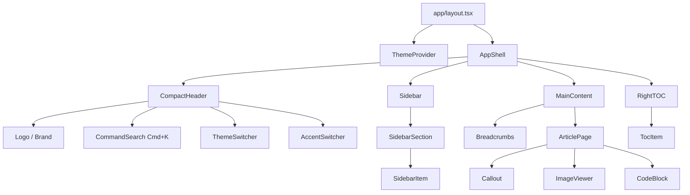
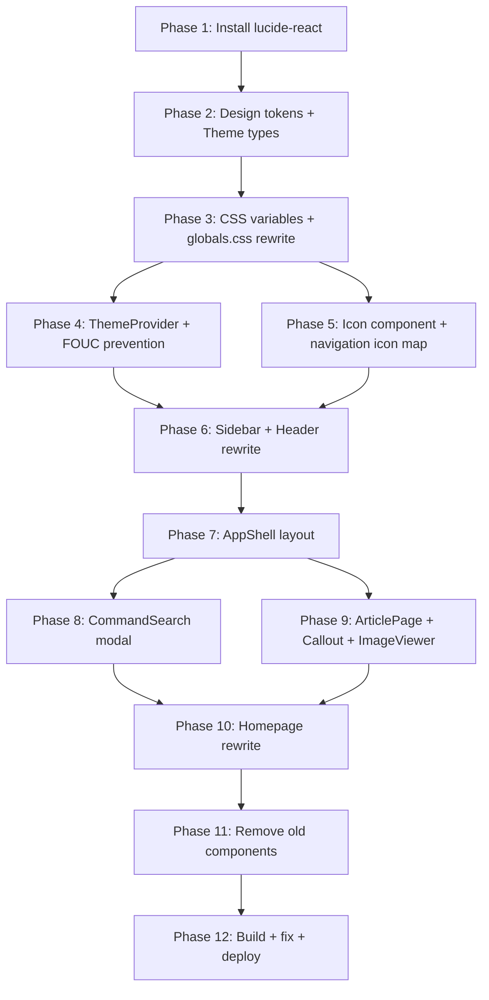

# UI Redesign Plan — Husk'd Lab Manuals

## Overview

Complete visual overhaul: from iOS/glassmorphism to a professional knowledge base (Linear/Vercel/Stripe Docs aesthetic). All existing content, URLs, and functionality preserved.

---

## Architecture Diagram



---

## Phase 1: Dependency Installation

**Step 1.1** — Install `lucide-react` for icons
```bash
npm install lucide-react
```

**Step 1.2** — Remove unused dependencies (optional):
- `zustand` — only used by deleted bongacams-simulator

---

## Phase 2: Design Token System (`lib/design-tokens.ts`)

Create a centralized token file that all components reference:

| Token | Values |
|-------|--------|
| spacing | 4, 8, 12, 16, 20, 24, 32, 40, 48, 64 |
| radius | 4, 6, 8, 10 |
| font-size | 13, 14, 15, 16, 18, 20, 24, 30, 36, 44 |
| font-weight | 400, 500, 600, 700 |
| line-height | 1.2, 1.5, 1.7 |

```typescript
// lib/design-tokens.ts
export const tokens = {
  spacing: { 1: '4px', 2: '8px', 3: '12px', 4: '16px', 5: '20px', 6: '24px', 8: '32px', 10: '40px', 12: '48px', 16: '64px' },
  radius: { sm: '4px', md: '6px', lg: '8px', xl: '10px' },
  fontSize: { xs: '13px', sm: '14px', base: '15px', lg: '16px', xl: '18px', '2xl': '20px', '3xl': '24px', '4xl': '30px', '5xl': '36px', '6xl': '44px' },
} as const;
```

---

## Phase 3: Theme System

### 3.1 Theme Types (`lib/themes.ts` — REWRITE)

```typescript
export type ThemeId = 'dark' | 'light' | 'midnight' | 'graphite';
export type AccentId = 'purple' | 'blue' | 'green' | 'orange' | 'red';

export interface ThemeConfig {
  id: ThemeId;
  name: string;
  colors: {
    background: string;
    backgroundSecondary: string;
    surface: string;
    surfaceHover: string;
    border: string;
    textPrimary: string;
    textSecondary: string;
    textMuted: string;
    accent: string; // overridden by accent color
    accentHover: string;
    accentSubtle: string;
    sidebarBackground: string;
    codeBackground: string;
  };
}
```

### 3.2 Theme Definitions (CSS Variables in `globals.css`)

**Dark** (`[data-theme="dark"]`):
```css
--background: #0b0c0e
--background-secondary: #101114
--surface: #15171a
--surface-hover: #1c1e23
--border: rgba(255,255,255,0.08)
--text-primary: #f5f5f5
--text-secondary: #a1a1aa
--text-muted: #71717a
--sidebar-bg: #0e0f11
--code-bg: #15171a
```

**Light** (`[data-theme="light"]`):
```css
--background: #ffffff
--background-secondary: #f7f7f8
--surface: #ffffff
--surface-hover: #f4f4f5
--border: rgba(0,0,0,0.1)
--text-primary: #18181b
--text-secondary: #52525b
--text-muted: #a1a1aa
--sidebar-bg: #f7f7f8
--code-bg: #f4f4f5
```

**Midnight** (`[data-theme="midnight"]`):
```css
--background: #0f1117
--background-secondary: #12141c
--surface: #181b26
--surface-hover: #1e2130
--border: rgba(255,255,255,0.06)
--text-primary: #e8eaed
--text-secondary: #9aa0a6
--text-muted: #6b7280
--sidebar-bg: #0d0f15
--code-bg: #181b26
```

**Graphite** (`[data-theme="graphite"]`):
```css
--background: #1a1b1e
--background-secondary: #1e1f22
--surface: #232427
--surface-hover: #2a2b2f
--border: rgba(255,255,255,0.07)
--text-primary: #e4e4e7
--text-secondary: #8f9098
--text-muted: #63646b
--sidebar-bg: #161719
--code-bg: #232427
```

### 3.3 Accent Colors (CSS Classes)

```css
[data-accent="purple"] { --accent: #8b5cf6; --accent-hover: #7c3aed; --accent-subtle: rgba(139,92,246,0.1); }
[data-accent="blue"]   { --accent: #3b82f6; --accent-hover: #2563eb; --accent-subtle: rgba(59,130,246,0.1); }
[data-accent="green"]  { --accent: #22c55e; --accent-hover: #16a34a; --accent-subtle: rgba(34,197,94,0.1); }
[data-accent="orange"] { --accent: #f97316; --accent-hover: #ea580c; --accent-subtle: rgba(249,115,22,0.1); }
[data-accent="red"]    { --accent: #ef4444; --accent-hover: #dc2626; --accent-subtle: rgba(239,68,68,0.1); }
```

### 3.4 ThemeProvider Component (`components/ThemeProvider.tsx`)

- Reads `theme` and `accent` from localStorage
- Applies `data-theme` and `data-accent` attributes to `<html>`
- Handles "system" mode via `prefers-color-scheme` media query
- Inline script in `<head>` to prevent FOUC (Flash of Unstyled Content)
- Smooth transition on theme change (opacity 150ms)

```tsx
// Inline script in layout.tsx <head>:
const themeScript = `
  (function() {
    const theme = localStorage.getItem('hl-theme') || 'system';
    const accent = localStorage.getItem('hl-accent') || 'purple';
    const root = document.documentElement;
    if (theme === 'system') {
      const prefersDark = window.matchMedia('(prefers-color-scheme: dark)').matches;
      root.setAttribute('data-theme', prefersDark ? 'dark' : 'light');
    } else {
      root.setAttribute('data-theme', theme);
    }
    root.setAttribute('data-accent', accent);
  })();
`;
```

### 3.5 ThemeSwitcher Component (`components/ThemeSwitcher.tsx` — REWRITE)

- Located in the header (not floating bottom-right)
- Dropdown menu with theme options + accent color picker
- Options: Light, Dark, Midnight, Graphite, System
- Accent colors: Purple, Blue, Green, Orange, Red
- Keyboard accessible
- Compact design (icon button that opens a small popover)

---

## Phase 4: CSS Architecture (`app/globals.css` — REWRITE)

### 4.1 Remove all iOS/glassmorphism classes
Remove:
- `.apple-glass`, `.apple-glass-strong`
- `.apple-card`, `.apple-cell`, `.apple-pill`
- `.apple-shadow-sm/md/lg/xl`
- `.bg-orb`, `@keyframes float-orb`
- All `backdrop-filter` usage
- `.cursor-dimple`, `@keyframes silver-shimmer/gold-sparkle`
- `.nav-bronze`, `.nav-silver`, `.nav-gold` and their animations
- `.theme-label-text`

### 4.2 New base styles

```css
@theme inline {
  --color-bg-primary: var(--background);
  --color-bg-secondary: var(--background-secondary);
  --color-surface: var(--surface);
  --color-surface-hover: var(--surface-hover);
  --color-border: var(--border);
  --color-text-primary: var(--text-primary);
  --color-text-secondary: var(--text-secondary);
  --color-text-muted: var(--text-muted);
  --color-accent: var(--accent);
  --color-accent-hover: var(--accent-hover);
  --color-accent-subtle: var(--accent-subtle);
  --color-sidebar-bg: var(--sidebar-bg);
  --color-code-bg: var(--code-bg);
}

body {
  background: var(--background);
  color: var(--text-primary);
  font-family: var(--font-sans);
  -webkit-font-smoothing: antialiased;
}
```

### 4.3 Design token CSS classes

```css
.ds-card {
  background: var(--surface);
  border: 1px solid var(--border);
  border-radius: 8px;
}
.ds-card:hover {
  border-color: var(--accent);
  box-shadow: 0 1px 3px rgba(0,0,0,0.1);
}
```

---

## Phase 5: Layout Components

### 5.1 AppShell (`components/AppShell.tsx` — NEW)

The root layout wrapper.

```tsx
// Structure:
<div className="flex h-screen">
  <Sidebar />           {/* fixed left, 240px */}
  <div className="flex flex-1 flex-col">
    <Header />           {/* compact top bar, 52px */}
    <main className="flex-1 overflow-y-auto">
      <div className="mx-auto max-w-4xl px-8 py-10">
        {children}
      </div>
    </main>
  </div>
  <TableOfContents />    {/* right side, xl screens only */}
</div>
```

### 5.2 CompactHeader (`components/Header.tsx` — REWRITE)

```tsx
// Height: 52px (h-13)
// Layout: Logo | Search | ThemeSwitcher
// Fixed top, border-bottom
<header className="flex h-[52px] items-center border-b border-border bg-bg-primary px-6 gap-4 sticky top-0 z-30">
  <Link href="/" className="flex items-center gap-2.5 font-semibold text-sm">
    <span className="flex h-7 w-7 items-center justify-center rounded-md bg-accent text-white text-xs font-bold">
      HL
    </span>
    <span className="hidden sm:inline">Husk'd Lab Manuals</span>
  </Link>
  
  <div className="flex-1 flex justify-center">
    <CommandSearch />   {/* Cmd+K */}
  </div>
  
  <ThemeSwitcher />
</header>
```

### 5.3 Sidebar (`components/Sidebar.tsx` — REWRITE)

```tsx
// Width: 240px
// Background: var(--sidebar-bg)
// Border-right: 1px solid var(--border)
// No glassmorphism, no rounded corners
// Fixed position on desktop
// Drawer overlay on mobile

// Top section:
// - "Search docs" input with Cmd+K badge
// Navigation sections:
// - Upper-case label: "НАЧАЛО РАБОТЫ" (muted, 11px, letter-spacing)
// - Items: compact (32px height), 13-14px font
// - Active: subtle bg with left accent border (2px)
// - Hover: bg slightly lighter
```

**SidebarItem component** (`components/SidebarItem.tsx` — NEW):

```tsx
// height: 32px
// padding: 0 12px
// border-radius: 6px
// icon: 16px, lucide
// Active state: 
//   background: var(--accent-subtle)
//   border-left: 2px solid var(--accent)
//   font-medium
// Inactive state:
//   color: var(--text-muted)
// Hover: bg-surface-hover
```

### 5.4 TableOfContents (`components/TableOfContents.tsx` — REWRITE)

```tsx
// Only visible on xl screens (1280px+)
// Width: 200px
// Sticky, top: 80px
// No glassmorphism, no rounded container
// Just a text list with active state

// Active item:
//   color: var(--accent)
//   font-medium
// Inactive:
//   color: var(--text-muted)
//   hover: text-text-primary
```

---

## Phase 6: Search System

### 6.1 CommandSearch (`components/CommandSearch.tsx` — NEW)

- Cmd+K / Ctrl+K triggers a modal overlay
- Modal has a search input at top
- Results appear below as user types
- Keyboard navigation (arrows, enter, escape)
- Powered by existing `lib/search-index.ts`
- Uses lucide `Search` icon

```
┌─────────────────────────────────────────┐
│ 🔍  Поиск по справочнику...             │
│─────────────────────────────────────────│
│ Гайд по Chaturbate                      │
│ Начало работы  →  Как начать трансляцию │
│─────────────────────────────────────────│
│ Гайд по Stripchat                       │
│ Начало работы  →  Основы                │
└─────────────────────────────────────────┘
```

### 6.2 SearchBar — Keep as lightweight inline search for sidebar

Keep the existing `SearchBar.tsx` but restyle it:
- Remove rounded-full styling, use rounded-md (6px)
- No glassmorphism, no shadow
- Simple border + background

---

## Phase 7: Content Components

### 7.1 ArticlePage (`components/ArticlePage.tsx` — REWRITE)

```tsx
// Remove apple-card wrapper
// Add breadcrumbs at top
// Title: h1, text-3xl/tracking-tight
// Description: muted text
// Content: directly rendered without card wrapper

// Add lightbox support for images
// Add callout component styles
```

### 7.2 Callout (`components/Callout.tsx` — NEW)

Four variants: info, warning, success, danger.

```tsx
// Uses lucide icons for each type
// Info: Info icon, blue border/background
// Warning: AlertTriangle icon, amber border/background  
// Success: CheckCircle icon, green border/background
// Danger: AlertOctagon icon, red border/background

export function Callout({ type, title, children }) {
  const styles = {
    info: { border: 'border-blue-500/30', bg: 'bg-blue-500/5', icon: Info, color: 'text-blue-500' },
    warning: { border: 'border-amber-500/30', bg: 'bg-amber-500/5', icon: AlertTriangle, color: 'text-amber-500' },
    // ...
  };
  return (
    <div className={`rounded-lg border ${style.border} ${style.bg} p-4 my-6`}>
      <div className="flex items-start gap-3">
        <Icon className={`h-5 w-5 mt-0.5 ${style.color}`} />
        <div>
          {title && <p className="font-medium text-sm mb-1">{title}</p>}
          <div className="text-sm text-text-secondary">{children}</div>
        </div>
      </div>
    </div>
  );
}
```

### 7.3 ImageViewer / Lightbox (`components/ImageViewer.tsx` — NEW)

```tsx
// Wraps Next/Image
// Click to open fullscreen overlay
// Escape to close
// Close button in top-right
// Dark overlay background
// Smooth open/close animation
// Styling: border, rounded-lg, not rounded-2xl
```

### 7.4 CategoryCard (`components/CategoryCard.tsx` — NEW)

For the homepage grid:

```tsx
// 3-column grid on desktop
// Card with icon area at top
// Title + description + "→ Open" link
// Styling: surface bg, 1px border, rounded-lg
// Hover: border-color changes to accent, slight lift
```

### 7.5 Breadcrumbs (`components/Breadcrumbs.tsx` — NEW)

```tsx
// Shows: Начало работы / Гайд по Stripchat
// Small text, muted, with chevron separators
// Last item is text-primary
// Uses usePathname() and navigation data
// No icons, just text links
```

---

## Phase 8: Homepage (`app/page.tsx` — REWRITE)

Replace current redirect with a documentation portal:

```tsx
// Hero section:
//   "Husk'd Lab Manuals"
//   "Внутренний справочник команды"
//   Description text

// "Популярное" section with CategoryCard grid
// Cards for each main guide/category
// 3 cols desktop, 2 tablet, 1 mobile

// "Все разделы" section linking to navigation sections
```

---

## Phase 9: Icon Migration

### 9.1 Replace SFSymbol with Lucide

Map all current icon names in [`lib/navigation.ts`](lib/navigation.ts) to Lucide equivalents:

| Current | Lucide |
|---------|--------|
| `key.fill` | `Key` |
| `wrench` | `Wrench` |
| `link` | `Link` |
| `building.2` | `Building2` |
| `book.closed` | `Book` |
| `envelope.fill` | `Mail` |
| `person.crop.circle` | `UserCircle` |
| `gearshape.fill` | `Settings` |
| `square.stack.3d.up` | `Layers` |
| `puzzlepiece.extension` | `Puzzle` |
| `star` | `Star` |
| `play.circle` | `PlayCircle` |
| `desktopcomputer` | `Monitor` |
| `sparkles` | `Sparkles` |
| `hand.raised` | `Hand` |
| `doc.text` | `FileText` |
| `timer` | `Timer` |
| `target` | `Target` |
| `dice` | `Dice` |
| `chart.bar` | `BarChart` |
| `doc.plaintext` | `File` |
| `list.bullet` | `List` |
| `quote.bubble` | `Quote` |
| `hand.thumbsdown` | `ThumbsDown` |
| `exclamationmark.circle` | `AlertCircle` |
| `eye.slash` | `EyeOff` |
| `figure.wave` | `Wave` |
| `robot` | `Bot` |
| `antenna.radiowaves.left.and.right` | `Radio` |
| `heart.text` | `Heart` |
| `message` | `MessageSquare` |
| `shield` | `Shield` |
| `house` | `Home` |

### 9.2 Create Lucide wrapper component (`components/Icon.tsx` — NEW)

Lightweight wrapper around `lucide-react`:

```tsx
import { icons } from 'lucide-react';
import type { LucideProps } from 'lucide-react';

interface IconProps extends LucideProps {
  name: keyof typeof icons;
}

export function Icon({ name, ...props }: IconProps) {
  const LucideIcon = icons[name];
  return <LucideIcon {...props} />;
}
```

### 9.3 Remove `components/SFSymbol.tsx`

Can be deleted after migration is complete.

---

## Phase 10: Removed Components

Delete these files:
- `components/BackgroundOrbs.tsx`
- `components/CursorTrail.tsx`
- `components/SFSymbol.tsx`
- `components/FooterCredit.tsx` (optional — merge into AppShell)
- `components/TelegramContacts.tsx` (optional — merge into footer)

---

## Phase 11: LayoutWrapper Rewrite (`components/LayoutWrapper.tsx`)

Simplify to use AppShell pattern:

```tsx
"use client";
import { ThemeProvider } from "@/components/ThemeProvider";
import { AppShell } from "@/components/AppShell";

export default function LayoutWrapper({ children }) {
  return (
    <ThemeProvider>
      <AppShell>{children}</AppShell>
    </ThemeProvider>
  );
}
```

---

## Phase 12: Implementation Order



---

## Files to Create

| # | File | Purpose |
|---|------|---------|
| 1 | `lib/design-tokens.ts` | Centralized spacing/radius/typography tokens |
| 2 | `lib/themes.ts` | REWRITE — new ThemeId, AccentId, ThemeConfig types |
| 3 | `components/ThemeProvider.tsx` | Theme/accent management with FOUC protection |
| 4 | `components/Icon.tsx` | Lucide icon wrapper |
| 5 | `components/AppShell.tsx` | Root layout shell |
| 6 | `components/Header.tsx` | REWRITE — compact header |
| 7 | `components/Sidebar.tsx` | REWRITE — fixed sidebar |
| 8 | `components/SidebarSection.tsx` | Section label + items group |
| 9 | `components/SidebarItem.tsx` | Compact nav item |
| 10 | `components/CommandSearch.tsx` | Cmd+K search modal |
| 11 | `components/Callout.tsx` | Info/warning/success/danger blocks |
| 12 | `components/ImageViewer.tsx` | Click-to-zoom lightbox |
| 13 | `components/Breadcrumbs.tsx` | Breadcrumb navigation |
| 14 | `components/CategoryCard.tsx` | Homepage card |
| 15 | `components/AccentSwitcher.tsx` | Accent color picker |
| 16 | `plans/ui-redesign-plan.md` | This plan |

## Files to Modify

| # | File | Changes |
|---|------|---------|
| 1 | `app/globals.css` | Complete rewrite — 4 new themes, remove iOS styles |
| 2 | `lib/themes.ts` | Replace old 4 themes with new 4 + accent types |
| 3 | `lib/navigation.ts` | Icon names change to Lucide-compatible |
| 4 | `components/LayoutWrapper.tsx` | Simplify to ThemeProvider + AppShell |
| 5 | `components/Header.tsx` | Compact, border-bottom, integrated search |
| 6 | `components/Sidebar.tsx` | Fixed width, no glass, border-right |
| 7 | `components/NavItem.tsx` | Compact styling, left accent indicator |
| 8 | `components/NavSection.tsx` | Uppercase label, muted, no animations |
| 9 | `components/TreeNavigation.tsx` | Update imports for new components |
| 10 | `components/ArticlePage.tsx` | Remove apple-card, add breadcrumbs |
| 11 | `components/TableOfContents.tsx` | Minimal styling, no glass container |
| 12 | `components/SearchBar.tsx` | Compact styling |
| 13 | `components/SearchResultsDropdown.tsx` | Compact styling |
| 14 | `components/ThemeSwitcher.tsx` | Moved to header, includes accent picker |
| 15 | `app/layout.tsx` | Add FOUC prevention script in head |
| 16 | `app/page.tsx` | Replace redirect with documentation portal |

## Files to Delete

| # | File | Reason |
|---|------|--------|
| 1 | `components/BackgroundOrbs.tsx` | iOS aesthetic, removed |
| 2 | `components/CursorTrail.tsx` | iOS aesthetic, removed |
| 3 | `components/SFSymbol.tsx` | Replaced by lucide-react |
| 4 | `components/FooterCredit.tsx` | Merge into AppShell |
| 5 | `components/TelegramContacts.tsx` | Merge into AppShell |

---

## Implementation Notes

1. **Don't break existing pages** — all article pages (`/chaturbate-guide`, `/bongacams-guide`, `/stripchat-guide/*`, etc.) should work unchanged
2. **Don't change URLs** — keep all href paths identical
3. **Don't change search index** — `lib/search-index.ts` and `lib/navigation.ts` data stays the same (icons only change names)
4. **Don't change middleware** — `/middleware.ts` and all API routes unchanged
5. **Theme transition** — add `transition: background-color 200ms ease, color 200ms ease` to body
6. **FOUC prevention** — critical inline script in `<head>` before any CSS
7. **Mobile first** — sidebar as drawer with overlay on mobile
8. **All content preserved** — every guide page remains identical in content, only UI chrome changes
