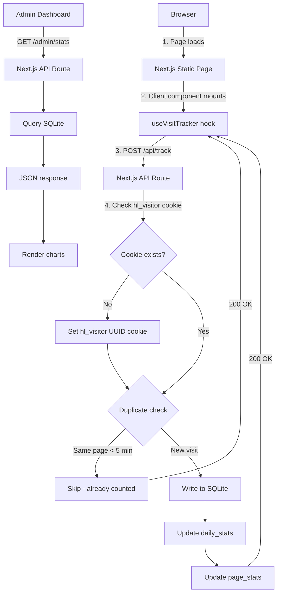

# Visit Tracking System — Architecture & Implementation Plan

## 1. Decision: Self-Hosted Backend API

**Chosen approach: Custom backend with SQLite + Next.js API Routes**

| Approach | Pros | Cons |
|----------|------|------|
| Google Analytics 4 | Free, feature-rich, dashboards built-in | Requires GA4 account, violates CSP `connect-src 'self'`, sends data to Google servers, overkill for a small manual site |
| Firebase Analytics | Free, realtime dashboard | Requires Firebase project, same CSP issue, vendor lock-in |
| **Self-hosted API (chosen)** | Full control, no external dependencies, CSP-compliant, lightweight, educational | Need to build dashboard ourselves |

**Why self-hosted wins for this project:**
- The site is a small reference manual (22 pages), not an e-commerce platform
- No need for complex funnel analysis or cohort reports
- We already have strict CSP — self-hosted keeps `connect-src 'self'`
- Railway can run the Next.js backend + SQLite with zero extra cost
- Full privacy — no user data leaves our server

---

## 2. Data Storage: SQLite via better-sqlite3

### Schema

```sql
CREATE TABLE visits (
  id            INTEGER PRIMARY KEY AUTOINCREMENT,
  page_path     TEXT NOT NULL,          -- e.g. /broadcasting/first-20-seconds
  page_title    TEXT,                   -- Human-readable page name
  referrer      TEXT,                   -- document.referrer
  user_agent    TEXT,                   -- navigator.userAgent (truncated)
  screen_width  INTEGER,               -- window.screen.width
  screen_height INTEGER,               -- window.screen.height
  country       TEXT DEFAULT NULL,      -- Optional: from IP geolocation
  visit_date    TEXT NOT NULL,          -- ISO date string: YYYY-MM-DD
  visit_time    TEXT NOT NULL,          -- ISO time string: HH:MM:SS
  created_at    TEXT NOT NULL DEFAULT (datetime('now'))
);

CREATE TABLE daily_stats (
  id            INTEGER PRIMARY KEY AUTOINCREMENT,
  date          TEXT NOT NULL UNIQUE,   -- YYYY-MM-DD
  total_visits  INTEGER NOT NULL DEFAULT 0,
  unique_visitors INTEGER NOT NULL DEFAULT 0,
  page_views    INTEGER NOT NULL DEFAULT 0,
  updated_at    TEXT NOT NULL DEFAULT (datetime('now'))
);

CREATE TABLE page_stats (
  id            INTEGER PRIMARY KEY AUTOINCREMENT,
  page_path     TEXT NOT NULL,
  page_title    TEXT,
  date          TEXT NOT NULL,          -- YYYY-MM-DD
  views         INTEGER NOT NULL DEFAULT 0,
  unique_views  INTEGER NOT NULL DEFAULT 0,
  UNIQUE(page_path, date)
);
```

### Why this schema
- **`visits`** — raw event log for detailed analysis (drill-down by page, date, referrer)
- **`daily_stats`** — pre-aggregated totals for the dashboard (fast queries)
- **`page_stats`** — per-page view counts for popularity ranking
- All timestamps in UTC, ISO format for easy sorting

---

## 3. Anti-Fraud / Deduplication

### 3.1 Session Cookie (Primary defense)

```text
Cookie: hl_visitor=<uuid>; Max-Age=86400; Path=/; HttpOnly; SameSite=Lax
```

- On first visit, server sets a `hl_visitor` UUID cookie (24-hour expiry)
- Same `hl_visitor` + same `page_path` within 5 minutes = **not counted** (dedup)
- This prevents F5 spam and accidental double-counts

### 3.2 Rate Limiting (Server-side)

```text
- Max 60 requests/minute per IP (in-memory Map with TTL)
- Max 1 visit record per page per session per 5 minutes
```

### 3.3 Unique Visitor Calculation

```sql
SELECT COUNT(DISTINCT visitor_id) FROM visits WHERE visit_date = '2026-07-03';
```

Where `visitor_id` = SHA256 hash of `(hl_visitor cookie + user_agent + IP)`.

---

## 4. Architecture Diagram



---

## 5. File Structure

```
lib/
  db.ts              -- SQLite connection singleton + schema init
  tracker.ts         -- Server-side visit recording logic
  dedup.ts           -- Deduplication helpers (cookie check, rate limit)

components/
  VisitTracker.tsx   -- Client component: fires POST /api/track on mount
  AdminStats.tsx     -- Admin dashboard component (charts + tables)

app/
  api/
    track/
      route.ts       -- POST /api/track — receive visit event
    stats/
      route.ts       -- GET /api/stats — return aggregated data (admin only)
  admin/
    page.tsx         -- Admin dashboard page (password-protected)
    layout.tsx       -- Admin layout with auth check

plans/
  visit-tracking-system.md  -- This document
```

---

## 6. Component Details

### 6.1 [`lib/db.ts`](lib/db.ts)
- Initialize `better-sqlite3` connection to `data/visits.db`
- Run `CREATE TABLE IF NOT EXISTS` on first load
- Export `db` singleton
- **Note:** `better-sqlite3` requires native compilation. For Railway, use `better-sqlite3` buildpack or switch to `sql.js` (pure JS, no native deps)

### 6.2 [`lib/tracker.ts`](lib/tracker.ts)
```typescript
export function recordVisit(params: {
  pagePath: string;
  pageTitle: string;
  referrer: string;
  userAgent: string;
  screenWidth: number;
  screenHeight: number;
  visitorId: string;
}): void
```
- Inserts into `visits` table
- Upserts into `daily_stats` (increment counters)
- Upserts into `page_stats` (increment counters)

### 6.3 [`lib/dedup.ts`](lib/dedup.ts)
```typescript
export function isDuplicate(visitorId: string, pagePath: string): boolean
```
- In-memory `Map<string, number>` keyed by `visitorId:pagePath`
- Value = timestamp of last visit
- Returns `true` if last visit < 5 minutes ago
- Periodically cleans expired entries (every 60 seconds)

### 6.4 [`components/VisitTracker.tsx`](components/VisitTracker.tsx)
- Client component, renders nothing (`return null`)
- On mount: reads `document.referrer`, `navigator.userAgent`, `window.screen`
- Fires `POST /api/track` with JSON body
- Uses `fetch` with `keepalive: true` for reliability on page unload

### 6.5 [`app/api/track/route.ts`](app/api/track/route.ts)
- `POST` handler
- Validates input (path required, max length 255)
- Reads/creates `hl_visitor` cookie
- Checks dedup
- Calls `recordVisit()`
- Returns `{ ok: true }`

### 6.6 [`app/api/stats/route.ts`](app/api/stats/route.ts)
- `GET` handler
- Requires `Authorization: Bearer <ADMIN_TOKEN>` header
- Returns JSON:
  ```json
  {
    "daily": [
      { "date": "2026-07-03", "totalVisits": 42, "uniqueVisitors": 15, "pageViews": 87 }
    ],
    "pages": [
      { "pagePath": "/broadcasting/first-20-seconds", "pageTitle": "...", "views": 12 }
    ],
    "realtime": { "todayVisits": 5, "todayUnique": 3 }
  }
  ```

### 6.7 [`app/admin/page.tsx`](app/admin/page.tsx)
- Password-protected via simple token in `.env.local` (`ADMIN_TOKEN`)
- Fetches `/api/stats` with token
- Renders:
  - **Header:** Total visits today, unique visitors today, all-time total
  - **Chart:** Daily visits bar chart (last 30 days) — using pure CSS/SVG bars (no chart library needed)
  - **Table:** Top pages by popularity
  - **Table:** Recent visits (last 50, with time, page, referrer, UA)

---

## 7. Environment Variables

```env
# .env.local / Railway Variables
ADMIN_TOKEN=your-secret-admin-token-here
DATABASE_PATH=data/visits.db
```

---

## 8. CSP Update

The current CSP has `connect-src 'self'` — this is already correct for self-hosted API. No changes needed.

However, the admin dashboard needs to be excluded from the static build. Add to [`next.config.ts`](next.config.ts):

```typescript
const nextConfig: NextConfig = {
  // ... existing config
  serverExternalPackages: ["better-sqlite3"],
};
```

---

## 9. Implementation Steps (Todo List)

1. **Install dependencies**: `npm install better-sqlite3 @types/better-sqlite3`
   - If native compilation fails on Windows, use `sql.js` instead: `npm install sql.js`
2. **Create [`lib/db.ts`](lib/db.ts)** — SQLite connection + schema initialization
3. **Create [`lib/dedup.ts`](lib/dedup.ts)** — In-memory deduplication with 5-minute window
4. **Create [`lib/tracker.ts`](lib/tracker.ts)** — Visit recording logic (insert + upsert)
5. **Create [`app/api/track/route.ts`](app/api/track/route.ts)** — POST endpoint for visit events
6. **Create [`components/VisitTracker.tsx`](components/VisitTracker.tsx)** — Client component that fires on mount
7. **Integrate VisitTracker into [`components/LayoutWrapper.tsx`](components/LayoutWrapper.tsx)** — Add `<VisitTracker />` to the layout
8. **Create [`app/api/stats/route.ts`](app/api/stats/route.ts)** — GET endpoint for aggregated stats (token-protected)
9. **Create [`app/admin/page.tsx`](app/admin/page.tsx)** — Admin dashboard with charts and tables
10. **Update [`next.config.ts`](next.config.ts)** — Add `serverExternalPackages` for better-sqlite3
11. **Build & verify** — `npm run build` should pass
12. **Push to GitHub** — `git add -A && git commit && git push`

---

## 10. Alternative: sql.js (Pure JS SQLite)

If `better-sqlite3` fails to compile (common on Windows without build tools), use `sql.js`:

```typescript
import initSqlJs from "sql.js";
import fs from "fs";

const DB_PATH = "data/visits.db";

let db: any = null;

export async function getDb() {
  if (db) return db;
  const SQL = await initSqlJs();
  if (fs.existsSync(DB_PATH)) {
    const buffer = fs.readFileSync(DB_PATH);
    db = new SQL.Database(buffer);
  } else {
    db = new SQL.Database();
  }
  db.run(`CREATE TABLE IF NOT EXISTS visits (...)`);
  return db;
}
```

`sql.js` is slower but requires zero native compilation — guaranteed to work everywhere.
